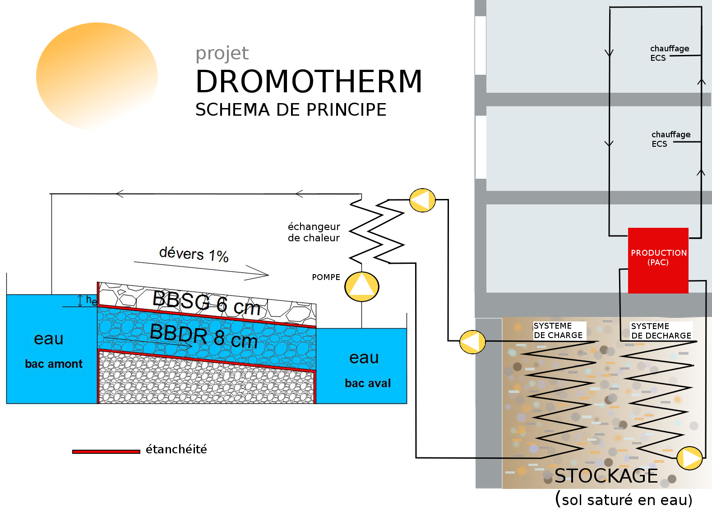

# the DROMOTHERM project

Check [dromotherm.com](http://www.dromotherm.com)

## The physics

[Présentation du projet](doc/Clermont-co_Cerema_dromotherm.pdf)

## The controller
Artificial intelligence for energy management

[DROMOSENSE - le premier brouillon](doc/smart_grid_version_test_15_01_2017.pdf)

# the Themis project

[Install Themis](Themis/Note_install_Themis.md)

# miscellaneous

[produire des documents tek sous github avec pandoc](doc/pandoc_tek_producing.md)

