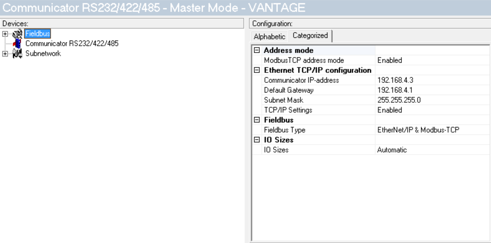

# config/tools pour la chaufferie du DLCF

## Anybus AB7007
https://www.anybus.com/fr/support/file-doc-downloads/communicator-specific/?ordercode=AB7007

[Anybus Communicator Manager (ACM)](hms-scm-1204-169.zip)




in order to get the mac address of the module, once connected to a network with 192.168.4.3 as IP address, open a telnet session `telnet 192.169.4.3` and issue the command `version`

```
HMS AnyBus-S Ethernet module
Admin mode, no login required

\> version
HMS AnyBus-S Ethernet module

Software version:   3.03.01
Bootloader version: 2.00.02
Serial number:      0xA0340CD9
MAC address:        00-30-11-1D-C9-2E
FB type:            0x0083

\>

```

## Sofrel S500

https://dromotherm.s3.eu-west-3.amazonaws.com/Setup_S500_v5.30.11.zip


