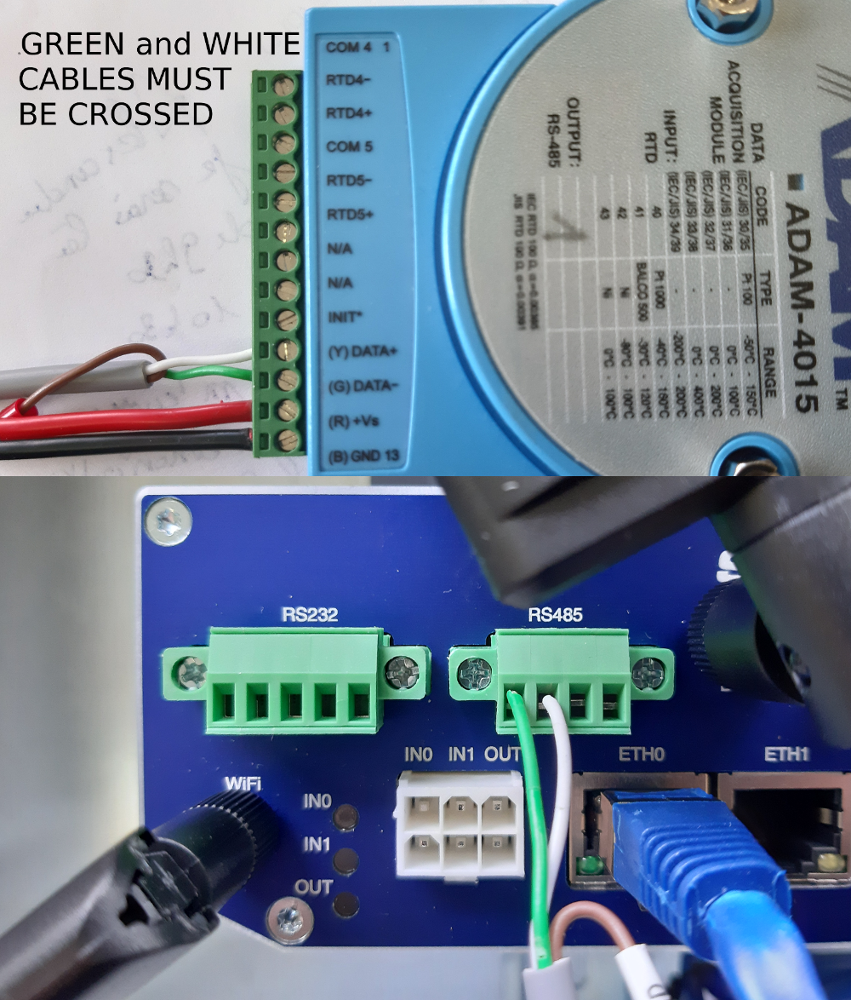

# Using PT 100 and ADAM 4015

Using and ohmmeter, find the wires between which a resistance is present

# Using thermocouple

Type T

Composition : cuivre / Constantan (alliage cuivre + nickel)

Usage continu de −185 °C à 300 °C ; usage intermittent de −250 °C à 400 °C4.

Répétabilité exceptionnelle de +/-0,1 °C de −200 °C à 200 °C.

Forte conductivité thermique du cuivre.

Couleurs selon CEI 584-3 : Gaine Marron / + Marron/ - Blanc
