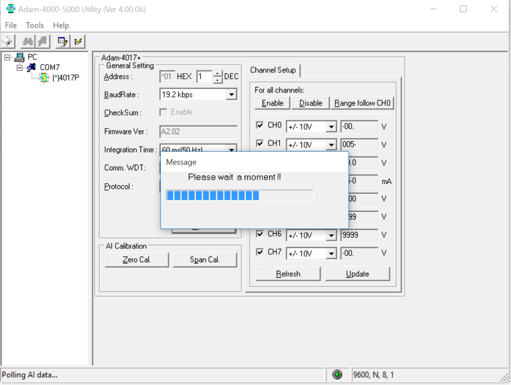

# Using PT 100 and ADAM 4015

## connexions

Using and ohmmeter, find the wires between which a resistance is present


## ADAM4015 configuration for operation on a RS485 network

### Init mode

Booting the ADAM4015 in Init mode can be done by using the specific switch on recent models or by connecting the init terminal to the
GND terminal

After the device discovered, choose modbus for the protocol, 19.2 Kbps for the baudrate and press update




## emonhub configuration

node section example in emonhub :

```
[[11]]
    nodename = PT1000
    [[[rx]]]
       names = CH0,CH1,f1,f2
       registers =1,2,211,212
       datacode = H
       scale = 1
```

for register numbers, check doc on ADAM4015 on Advantech website

parameter |register for emonhub|register for modbusdoctor
--- | ---  | ---
channel 0|1|0
channel 1|2|1
channel 2|3|2
channel 3|4|3
channel 4|5|4
channel 5|6|5
channel 6|7|6
channel 7|8|7
module name 1|211|210 or D2h
module name 2|212|211 or D3h

http://www.kscada.com/modbusdoctor.html

# Using thermocouple

Type T

Composition : copper / Constantan (copper + nickel)

From −185 °C to 300 °C ;

accuracy  +/-0,1 °C from −200 °C to 200 °C.

CEI 584-3  
> - brown rubber sheath
> - brown = +
> - white = -
