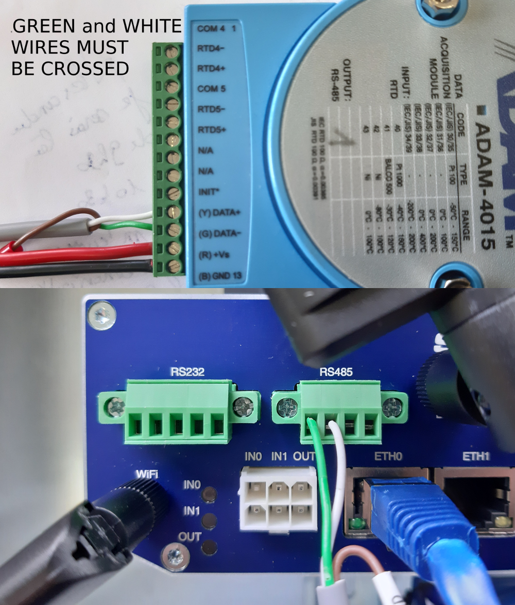

# Using PT 100 and ADAM 4015

Using and ohmmeter, find the wires between which a resistance is present




node section example in emonhub :

```
[[11]]
    nodename = PT1000
    [[[rx]]]
       names = CH0,CH1,f1,f2
       registers =1,2,211,212
       datacode = H
       scale = 1
```

for register numbers, check doc on ADAM4015 on Advantech website

parameter |register for emonhub|register for modbusdoctor
--- | ---  | ---
channel 0|1|0
channel 1|2|1
channel 2|3|2
channel 3|4|3
channel 4|5|4
channel 5|6|5
channel 6|7|6
channel 7|8|7
module name 1|211|210 or D2h
module name 2|212|211 or D3h

http://www.kscada.com/modbusdoctor.html

# Using thermocouple

Type T

Composition : copper / Constantan (copper + nickel)

From −185 °C to 300 °C ;

accuracy  +/-0,1 °C from −200 °C to 200 °C.

CEI 584-3  
> brown rubber sheath Marron
> + brown
> - white
