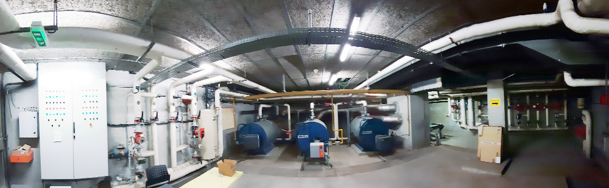

## [Cerema Clermont-Ferrand boiling room](emoncms-backup-2020-04-22.tar.gz)

to unpack :

```
wget https://raw.githubusercontent.com/alexandrecuer/smartgrid/master/datasets/emoncms-backup-2020-04-22.tar.gz
tar -xvf emoncms-backup-2020-04-22.tar.gz
```

hot water circuits !! collected during winter 2019-2020 before COVID 19 spreading in Europe

3 circuits monitored :
- cellules
- north
- south

circuit |label |	Feed Number | interval (s)
--|--|--|--
cellules|indoor temperature|56 (45) | 300
cellules|power consumption in W|66 | 10
north|indoor temperature|48 | 300
north|power consumption in W|68 | 10
south|indoor temperature|51 | 300
north|power consumption in W|70 | 10
all|outdoor temperature|18 | 10
all|global solar radiation in W/m2|21 | 10

all power calculated with constant flow rates, using the water heat capacity : 1162.5 Wh/m-3/K

circuit |label |	Feed Number | interval (s)
--|--|--|--
cellules|pump on/off | 26 | 10
cellules|3-way valve closing | 27 | 10
cellules|3-way valve opening | 28 | 10
north|pump on/off | 32 | 10
north|3-way valve closing | 33 | 10
north|3-way valve opening | 34 | 10
south|pump on/off | 37 | 10
south|3-way valve closing | 38 | 10
south|3-way valve opening | 39 | 10

circuits temperatures in °C |	Feed Number | interval (s)
--|--
T initial cellules | 25 | 10
T return cellules | 29 | 10
T initial north | 31 | 10
T return north | 35 | 10
T initial south | 36 | 10
T return south | 40 | 10

circuit | flow rate in m3/h
--|--
cellules | 5.19
north | 6.5 
south | 4.2
East | 1.38
West | 1.1
Hall basement | 2.6
