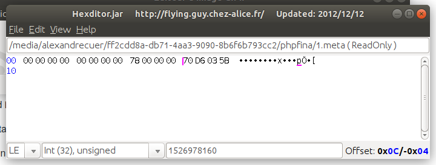
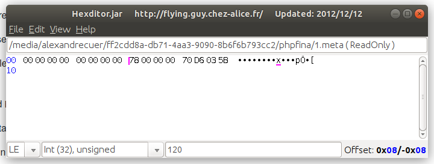

# kit of datasets collected from the field

All datasets are in [emoncms](http://github.com/emoncms/emoncms) format

A single dataset consists of 2 files :
- a .meta file
- a .dat file

All data stored in .dat file are 4 bytes (32 bits) float

To control metas if doubt, open the .meta file	
it contains 16 bytes	
- 4 bytes	Unused – deprecated
- 4 bytes	Unused – deprecated
- 4 bytes	Interval – unsigned integer
- 4 bytes	start time – unsigned integer

You may need an editor to perform such a manual check. On a linux OS, [Hexditor](http://flying.guy.chez-alice.fr/HexditorFr.php) is a cool choice :-)

## Exemple of a meta file opening 
On this exemple, the timeserie starts at 1526978160, unix time stamp, which is Tuesday, 22-May-2018 08:36:00 UTC, with a recordng interval of 120 s

**Please note endianness is Little Endian (LE)**

## operation

most sets can be restored on an EmonPI. 
The EmonPI is a very cheap and efficient data monitoring and managing platform. [Buy it here](https://shop.openenergymonitor.com/emonpi/)

when restoring sets coming from deprecated versions of emoncms, a database update can be necessary

'''
cd /opt/openenergymonitor/EmonScripts/common
php 
'''

## python library

