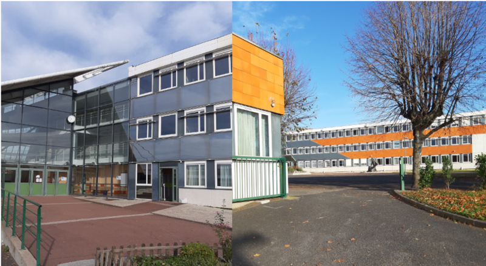

# collège Marc Bloch



[download dataset](emoncms-backup-2021-05-24.tar.gz)

collected from february to june 2021

environ 800 à 1000 élèves

une chaufferie desservant 5 à 6 sous-stations

puissance de la chaudière de tête : 350 KW

to unpack :

```
wget https://raw.githubusercontent.com/alexandrecuer/smartgrid/master/datasets/emoncms-backup-2021-05-24.tar.gz
tar -xvf emoncms-backup-2021-05-24.tar.gz
```
Historisation dans les flux déclenché le 08/02/21

label|	Feed Number|	StartTime<br>unixTimestamp<br>(s)|	interval<br>(s)
--|--|--|--
Text	Timer| 4	|1612789800	|300	|°C
Text	°C | 5	|1612789800	|300	|°C
pompe 2 Sud W | 6	|1612789800	|300	|°C
pompe 2 Nord W | 23	|1612790100	|300	|°C
