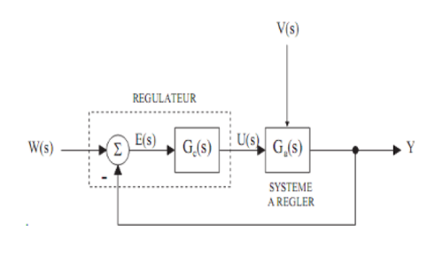
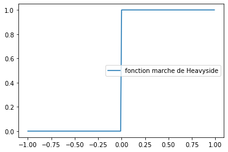
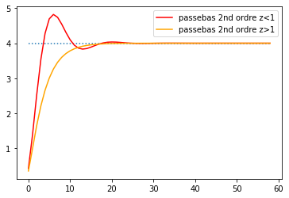
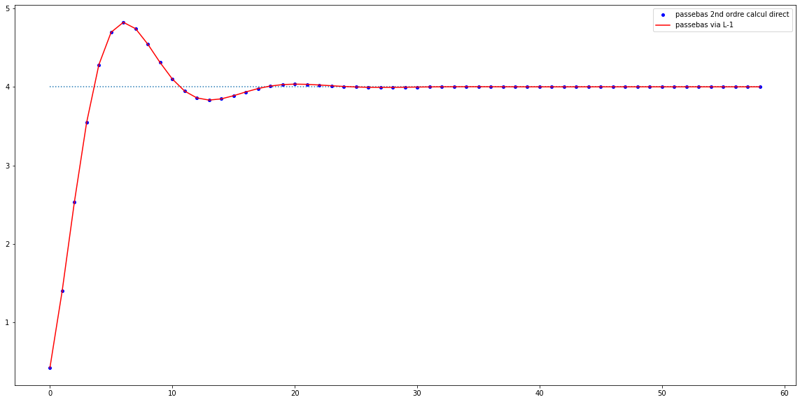

# Régulation PID

[wikipedia automatique](https://fr.wikipedia.org/wiki/Automatique)

https://fr.wikipedia.org/wiki/R%C3%A9gulateur_PID

https://www.robot-maker.com/forum/tutorials/article/12-asservissement-et-regulation/



Notons $e(t)$ l'erreur commise par le système à asservir, $w(t)$ la consigne et $y(t)$ la mesure de la grandeur réglée

On a : $e(t) = w(t) - y(t)$

$v(t)$ est la perturbation qui affecte le système à asservir

Asservissons ce système à l'aide d'un PID caractérisé par :
- un coefficient proportionnel K
- une constante de temps intégrale $T_i$
- une constante de temps dérivée $T_d$

La réponse du régulateur PID $u(t)$ est donnée par la relation suivante : 
\begin{equation}
u(t) = K ( e(t) + \frac{1}{T_i}\int_{0}^{t} e(t) dt + T_d \frac{de}{dt} )
\end{equation}

Dans le domaine de Laplace, cette relation devient :
\begin{equation}
U(p) = K(1 + \frac{1}{T_i p} + T_d p) E(p)
\end{equation}

En effet, on montre par intégration par partie que : 
- le Laplacien de l'intégale d'une fonction f vaut $\frac{1}{p}$ fois le laplacien de f
- le laplacien de la dérivée d'une fonction f vaut $p$ fois le laplacien de la fonction f, à une constante près

cf https://fr.wikipedia.org/wiki/Transformation_de_Laplace

Pour rappel, le laplacien d'une fonction f(t) est :

\begin{equation}
F(p) = \int_{0}^{\infty} e^{-pt} f(t) dt
\end{equation}

Au final, on peut écrire :

\begin{equation}
U(p) = K(\frac{1+ T_i p + T_i T_d  p^2}{T_i p} ) E(p)
\end{equation}

On obtient l'expression de la fonction de transfert du régulateur PID, notée $G_c$ : 

\begin{equation}
G_c = K(\frac{1+ T_i p + T_i T_d  p^2}{T_i p} )
\end{equation}

Si l'on considère le système dans son ensemble et que l'on note $G_a$ la fonction de transfert de la machine à asservir, on a :

\begin{equation}
Y(p) = G_a * G_c * (W(p) - Y(p))
\end{equation}

ou encore :

\begin{equation}
Y(p) = \frac{G_a * G_c}{1+ G_a * G_c} * W(p) 
\end{equation}

On obtient l'expression de la fonction de transfert du système complet :

\begin{equation}
H_c(p) = \frac{G_a * G_c}{1+ G_a * G_c} 
\end{equation}

# Réponse indicielle
La réponse indicielle d'un système s'obtient sous la sollicitation d'un échelon, ie d'une fonction marche de Heavyside


```python
import numpy as np
l=100
heavyside=np.zeros(2*l)
for i in range(0,l):
    heavyside[l+i]=1

import matplotlib.pylab as plt
xrange=np.arange(-1.0,1.0,1/l)

plt.subplot(111)
plt.plot(xrange,heavyside,label="fonction marche de Heavyside")
plt.legend()
plt.show()

```





La transformée de Laplace de la fonction h(t) de Heavyside est 1/p

\begin{equation}
H(p) = \int_{0}^{\infty} e^{-pt} h(t) dt = \frac{-1}{p}  \int_{0}^{\infty} -pe^{-pt}  dt = \frac{-1}{p} [e^{-pt}]_{0}^{\infty} = \frac{1}{p}
\end{equation}

Si $H_c(p)$ est la fonction de transfert du système, le laplacien de la réponse indicielle est donc :

\begin{equation}
Y(p) = \frac{H_c(p)}{p} 
\end{equation}


```python
from mpmath import *
def F(p):
    return 4/(1+2*z*p/wn+(p/wn)**2)/p

# length to simulate in seconds
length=3
# step duration in seconds
step=0.05
# nb is number of steps to simulate  
nb=int(length//step)

# some numpy array to store the values
_target=4*np.ones(nb)
_lpz1=np.zeros(nb)
_lp1z=np.zeros(nb)
time=step
for i in range(0,nb):
    wn=10
    z=0.45
    _lpz1[i]=invertlaplace(F,time,method='talbot')
    wn=10
    z=1.12
    _lp1z[i]=invertlaplace(F,time,method='talbot')
    time+=step
    
plt.subplot(111)
plt.plot(_target,':')
plt.plot(_lpz1, color="red", label="passebas 2nd ordre z<1")
plt.plot(_lp1z, color="orange", label="passebas 2nd ordre z>1")
plt.legend()
plt.show()
```





On a utilisé la fonction `invertlaplace` de la bibliothèque mpmath mais la fonction de transfert du second ordre dont on est parti est le laplacien d'une fonction dont l'expression est connue.

\begin{equation}
F(p)=\frac{w_n^2}{p^2+2zw_np+w_n^2} =\frac{1}{1+2\frac{z}{w_n}p+(\frac{p}{w_n})^2}
\end{equation}

est le Laplacien de :

\begin{equation}
f(t)=\frac{w_n}{\sqrt{1-z^2}}e^{-zw_nt}sin(w_nt\sqrt{1-z^2})
\end{equation}

et 

\begin{equation}
F(p)=\frac{w_n^2}{p(p^2+2zw_np+w_n^2)} =\frac{1}{p(1+2\frac{z}{w_n}p+(\frac{p}{w_n})^2)}
\end{equation}

est le Laplacien de :

\begin{equation}
f(t)=1-\frac{1}{\sqrt{1-z^2}}e^{-zw_nt}sin(w_nt\sqrt{1-z^2}+arcos(z))
\end{equation}


```python
import math
def f(t):
    return 4*(1-1/sqrt(1-z**2)*math.exp(-z*wn*t)*math.sin(wn*t*sqrt(1-z**2)+math.acos(z)))

_lp=np.zeros(nb)
time=step
for i in range(0,nb):
    wn=10
    z=0.45
    _lp[i]=f(time)
    time+=step

fig = plt.figure(figsize=(20, 10))
plt.subplot(111)
plt.plot(_target,':')
plt.plot(_lp, 'o', color="blue", markersize=4, label="passebas 2nd ordre calcul direct")
plt.plot(_lpz1, color="red", label="passebas via L-1")
plt.legend()
plt.show()
```





```python

```
